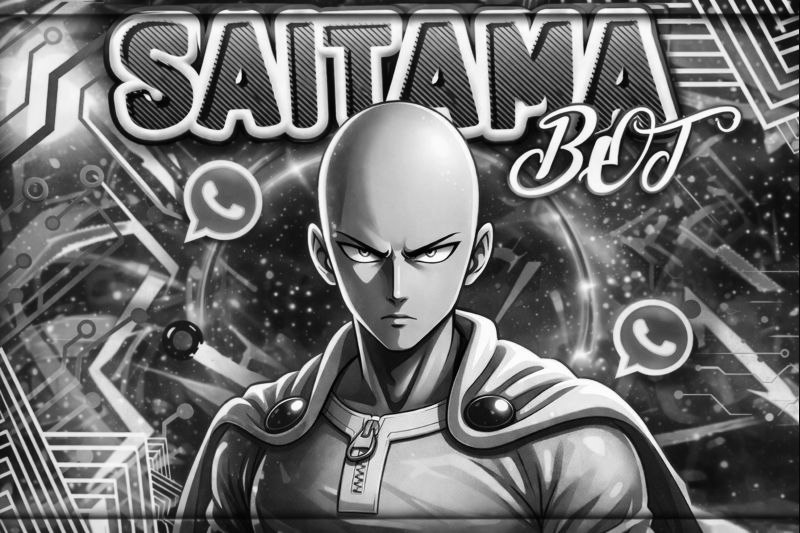

# 👊 Saitama Bot



> O melhor bot de WhatsApp, agora 100% atualizado e controlado por **Gumball**.

## 🚀 Instalação (Termux)

1.  Atualize os pacotes:
    ```sh
    pkg upgrade -y && pkg update -y && pkg install git -y && pkg install nodejs-lts -y && pkg install ffmpeg -y
    ```
2.  Clone este repositório:
    ```sh
    git clone https://github.com/Gumballxnz/saitama-bot-.git
    ```
3.  Entre na pasta:
    ```sh
    cd saitama-bot-
    ```
4.  Permissões:
    ```sh
    chmod -R 755 ./*
    ```
5.  Inicie o bot:
    ```sh
    npm start
    ```

## 💻 Instalação (VPS)

1.  Instale dependências:
    ```sh
    sudo apt update && sudo apt upgrade && sudo apt install ffmpeg git curl -y
    ```
2.  Instale Node.js 22:
    ```sh
    curl -o- https://raw.githubusercontent.com/nvm-sh/nvm/v0.40.3/install.sh | bash
    source ~/.bashrc
    nvm install 22
    ```
3.  Clone e Instale:
    ```sh
    git clone https://github.com/Gumballxnz/saitama-bot-.git
    cd saitama-bot-
    npm install
    npm install -g pm2
    ```
4.  Inicie com PM2 (24/7):
    ```sh
    pm2 start src/index.js --name 'saitama-bot'
    pm2 save
    pm2 startup
    ```

## 🛠️ Funcionalidades Principais

| Função | Quem usa? | Descrição |
| :--- | :--- | :--- |
| **!menu** | Todos | Mostra o menu principal |
| **!ban** @user | Admin | Bane um usuário do grupo |
| **!promover** @user | Admin | Promove usuário a admin |
| **!rebaixar** @user | Admin | Remove admin de usuário |
| **!link** | Admin | Pega o link do grupo |
| **!fechar** | Admin | Fecha o grupo para mensagens |
| **!abrir** | Admin | Abre o grupo |
| **!sticker** | Todos | Cria figurinha (mande foto ou vídeo) |
| **!play** nome | Todos | Baixa música do YouTube |
| **!tiktok** link | Todos | Baixa vídeo do TikTok sem marca |
| **!gpt** pergunta | Todos | Pergunta para a IA |

## ⚙️ Configuração

Edite o arquivo `src/config.js` para mudar configurações como:
*   Nome do Bot
*   Prefixo
*   Donos
*   Chaves de API

---

### © 2026 Saitama Bot
Desenvolvido e mantido por **Gumball**.
